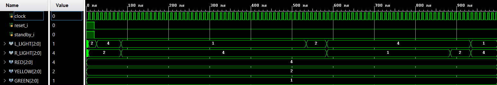
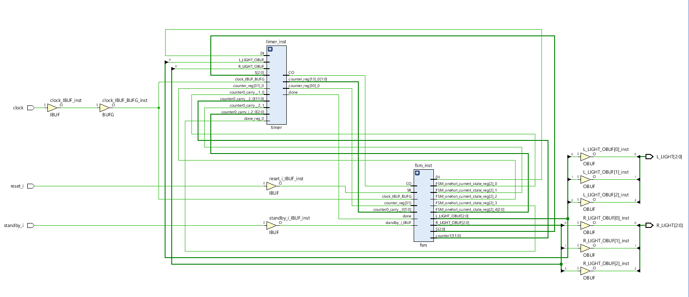

# Traffic Light Controller — Design Documentation

## 1. Overview

The Traffic Light Controller is a modular, synthesizable Verilog RTL design for controlling two traffic directions.

The system consists of a top-level controller, an FSM for control logic, and a timer for state durations.

```text
             Traffic Light Controller
                       │
              ┌────────┴────────┐
              │                 │
             FSM              Timer
              │                 │
              └────── done ─────┘
              │
          L / R Lights
```

| Module | Responsibility |
|---|---|
| `traffic_light_controller` | Top-level integration |
| `fsm` | State control and light outputs |
| `timer` | Clock-cycle counting and `done` generation |
| `traffic_light_controller_tb` | Functional verification |

## 2. FSM Design

The controller uses five states:

| State | Left | Right | Duration |
|---|---|---|---:|
| `YY` | Yellow | Yellow | — |
| `RY` | Red | Yellow | 5s |
| `GR` | Green | Red | 45s |
| `YR` | Yellow | Red | 5s |
| `RG` | Red | Green | 30s |

```text
YY → RY → GR → YR → RG
          ↑         │
          └─────────┘
```

The FSM advances when the timer asserts `done`.

## 3. Timer

The system uses:

```text
CLK_FREQ = 1 MHz
```

The timer counts clock cycles according to the selected state's duration and generates `done` when the interval expires.

## 4. Reset & Standby

Reset initializes the FSM and timer to a known state.

Standby places the traffic-light outputs in the defined standby condition instead of continuing the normal sequence.

## 5. Verification

A dedicated Verilog testbench was developed to verify:

- FSM state transitions
- Traffic-light outputs
- Timer behavior
- State timing
- Reset behavior
- Standby behavior

The simulation completed successfully.



## 6. Synthesis

**Tool:** Xilinx Vivado 2019.1  
**Target:** `xc7z010clg400-2`

Synthesis completed with:

```text
0 Errors
0 Critical Warnings
0 Warnings
```

### Resource Utilization

| Resource | Usage |
|---|---:|
| LUTs | 59 |
| Flip-Flops | 38 |
| BUFG | 1 |
| CARRY4 | 19 |
| IBUF | 3 |
| OBUF | 6 |

The synthesized design contains approximately 126 cells.



## 7. Project Structure

```text
Traffic-Light-Controller/
├── src/
│   ├── traffic_light_controller.v
│   ├── fsm.v
│   ├── timer.v
│   └── traffic_light_controller_tb.v
│
├── docs/
│   ├── DESIGN.md
│   └── images/
│       ├── simulation_waveform.png
│       └── synthesis_result.png
│
├── README.md
└── .gitignore
```

## 8. Future Improvements

- Add pedestrian crossing support
- Improve verification with assertions and additional test scenarios
- Add configurable traffic patterns and timing profiles
- Introduce automated simulation and verification using a CI workflow
